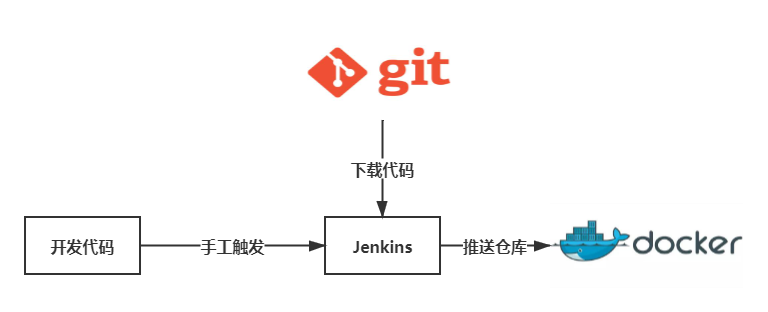

# 125.9 CI jenkins

## 1.CICD

- CI 的意思是 持续构建 。负责拉取代码库中的代码后，执行用户预置定义好的操作脚本，通过一系列编译操作构建出一个 制品 ，并将制品推送至到制品库里面。常用工具有 Gitlab CI，Github CI，Jenkins 等。这个环节不参与部署，只负责构建代码，然后保存构建物。构建物被称为 制品，保存制品的地方被称为 `制品库`
- CD 则有 2 层含义： `持续部署（Continuous Deployment）` 和 `持续交付（Continuous Delivery）` 。 持续交付 的概念是：将制品库的制品拿出后，部署在测试环境 / 交付给客户提前测试。 持续部署 则是将制品部署在生产环境。

## 2. 服务器

| 配置    | 技术栈                   | 类型  | 标签              |
| ------- | ------------------------ | ----- | ----------------- |
| 2 核 4G | Jenkins + Nexus + Docker | Cloud | 构建机            |
| 2 核 4G | Docker + Kubernetes      | Cloud | kubernetes Master |
| 1 核 1G | Docker + Kubernetes      | Cloud | kubernetes Node   |

## 3. 构建机 CI



### 3.1 安装 docker

```shell
# yum update # 更新yum 可有可无
yum install -y yum-utils device-mapper-persistent-data lvm2 # 安装工具包
sudo yum-config-manager --add-repo http://mirrors.aliyun.com/docker-ce/linux/centos/docker-ce.repo
yum install docker-ce -y # 安装docker 社区版
systemctl start docker # 启动docker
systemctl enable docker # 设置开机启动
```

配置阿里云镜像源

```shell
sudo mkdir -p /etc/docker
sudo tee /etc/docker/daemon.json <<-'EOF'
{
  "registry-mirrors": ["https://fwvjnv59.mirror.aliyuncs.com"]
}
EOF
# 重载所有修改过的配置文件
sudo systemctl daemon-reload
sudo systemctl restart docker
```

### 3.2 安装 git

```shell
yum install git -y
```

### 3.3 安装 Jenkins

- Jenkins 是一个基于 Java 语言开发的持续构建工具平台，主要用于持续、自动的构建/测试你的软件和项目。它可以执行你预先设定好的设置和构建脚本，也可以和 Git 代码库做集成，实现自动触发和定时触发构建

#### 3.3.1 安装 java

```shell
yum install -y java
```

#### 3.3.2 安装 jenkins

```shell
sudo wget -O /etc/yum.repos.d/jenkins.repo https://img.zhufengpeixun.com/jenkins.repo
sudo rpm --import https://img.zhufengpeixun.com/jenkins.io.key
yum install jenkins -y
```

#### 3.3.3 启动 Jenkins

```shell
 systemctl start jenkins.service
```

#### 3.3.4 开放端口

```
firewall-cmd --zone=public --add-port=8080/tcp --permanent
firewall-cmd --zone=public --add-port=50000/tcp --permanent
systemctl reload firewalld
```

#### 3.3.5 打开浏览器访问

```txt
http://8.136.218.128:8080/ 访问之后记得先执行 3.7.7修改插件景象 在点击安装推荐插件
```

#### 3.3.6 查看密码

```shell
cat /var/lib/jenkins/secrets/initialAdminPassword
```

#### 3.3.7 修改插件镜像

```shell
sed -i 's/http:\/\/updates.jenkins-ci.org\/download/https:\/\/mirrors.tuna.tsinghua.edu.cn\/jenkins/g' /var/lib/jenkins/updates/default.json && sed -i 's/http:\/\/www.google.com/https:\/\/www.baidu.com/g' /var/lib/jenkins/updates/default.json
```

#### 3.3.8 添加到 docker 用户组里

```shell
sudo gpasswd -a jenkins docker  #将当前用户添加至docker用户组
newgrp docker                 #更新docker用户组
systemctl restart jenkins.service # 重新启动jenkins
```

#### 3.3.9 新建任务

- http://8.136.218.128:8080/view/all/newJob
- 新建任务=>构建一个自由风格的软件项目=>配置>增加构建步骤

```shell
docker -v
docker pull node:latest
```

#### 3.3.10 安装 Nodejs

- 系统管理 => 插件管理 => 可选插件 => 安装 NodeJS 插件
- 全局工具配置 => NodeJS => 新增 NodeJS 这里的 nodejs 选对版本号 不然后边会报错
- 任务的配置=>构建环境=>选中 Provide Node & npm bin/ folder to PATH

默认会拉取这个地址的安装包，但有可能会失败,失败之后可以重复，这个只需要执行一次就可以了

```shell
Unpacking https://nodejs.org/dist/v15.11.0/node-v15.11.0-linux-x64.tar.gz to /var/lib/jenkins/tools/jenkins.plugins.nodejs.tools.NodeJSInstallation/nodejs15.11.0 on Jenkins
```

### 3.4 集成 Git 仓库

项目仓库

#### 3.4.1 生成公钥私钥

```shell
ssh-keygen -t rsa -C "zhufengnodejs@126.com"
```

#### 3.4.2 Gitee 配置公钥

设置=>安全设置 => SSH 公钥

```shell
cat ~/.ssh/id_rsa.pub
```

#### 3.4.3 在 Jenkins 配置私钥

- 在 Jenkins 中，私钥/密码 等认证信息都是以 凭证 的方式管理的
- 一定要确保先安装 git `yum install git -y`
- 配置 => 源码管理 => Git => Repositories
- Credentials => 添加 => SSH Username with private key
  - Username zhufengnodejs@126.com

### 3.5 构建镜像

#### 3.5.1 编写 Dockerfile

Dockerfile

```Dockerfile
FROM nginx:1.15
COPY build /etc/nginx/html
COPY conf /etc/nginx/
WORKDIR /etc/nginx/html
```

conf\site

```site
server {
    listen       80;
    server_name  _;
    root         /etc/nginx/html;
}
```

#### 3.5.2 Jenkins 配置脚本

构建 => 执行 Shell

```sh
#!/bin/sh
npm install --registry=https://registry.npm.taobao.org
npm run build
docker build -t react-project .
```

#### 3.5.3 执行任务

### 3.6 上传私有镜像库

- 镜像库就是集中存放镜像的一个文件服务
- 镜像库在 CI/CD 中，又称 制品库
- 构建后的产物称为制品，制品则要放到制品库做中转和版本管理
- 常用平台有 Nexus、Jfrog 和 Harbor 或其他对象存储平台

#### 3.6.1 部署 Nexus 服务

- nexus-3.29.0-02 是 nexus 主程序文件夹
- sonatype-work 则是数据文件

```shell
cd /usr/local
wget https://dependency-fe.oss-cn-beijing.aliyuncs.com/nexus-3.29.0-02-unix.tar.gz
tar -zxvf ./nexus-3.29.0-02-unix.tar.gz
cd nexus-3.29.0-02/bin
./nexus start

firewall-cmd --zone=public --add-port=8081/tcp --permanent
firewall-cmd --zone=public --add-port=8082/tcp --permanent

http://8.136.218.128:8081/
```

> nexus 还支持停止，重启等命令。可以在 bin 目录下执行 ./nexus help 查看更多命令

#### 3.6.2 配置 Nexus

- 可以使用 admin 用户登录 Nexus
- 注意请立即更改密码
- Enable anonymous access

```shell
cat /root/sonatype-work/nexus3/admin.password
```

#### 3.6.3 创建 Docker 私服

- 登录 => 齿轮图标 => Repositories => Create repository => docker(hosted) => HTTP(8082)

- proxy: 此类型制品库原则上只下载，不允许用户推送

- hosted：此类型制品库和 proxy 相反，原则上 只允许用户推送，不允许缓存。这里只存放自己的私有镜像或制品
- group：此类型制品库可以将以上两种类型的制品库组合起来

#### 3.6.4 添加访问权限

- 齿轮图标 => Realms => Docker Bearer Token Realm => 添加到右边的 Active =>保存
- copy http://118.190.142.109:8081/repository/dockcer-repository/

#### 3.6.5 登录制品库

vi /etc/docker/daemon.json

```json
{
  "insecure-registries": ["8.136.218.128:8082"],
  "registry-mirrors": ["https://fwvjnv59.mirror.aliyuncs.com"]
}
```

```shell
systemctl restart docker
docker login 8.136.218.128:8082 //注意此处要和insecure-registries里的地址一致
Username: admin
Password: 123456
```

#### 3.6.6 推送镜像到制品库

- 设置界面 => 构建环境 => 勾选 Use secret text(s) or file(s) => 新增选择 => Username and password (separated)

  - DOCKER_LOGIN_USERNAME
  - DOCKER_LOGIN_PASSWORD

- 接着在下面指定凭据=>添加 jenkins=>选择类型 Username with password,输入用户名和密码然后点添加确定

```sh
#!/bin/sh -l

npm install --registry=https://registry.npm.taobao.org
npm run build
docker build -t 8.136.218.128:8082/react-project .
docker login -u $DOCKER_LOGIN_USERNAME -p $DOCKER_LOGIN_PASSWORD 8.136.218.128:8082
docker push 8.136.218.128:8082/react-project
```

- 然后就可以查看镜像了,注意端口是 8081
- http://8.136.218.128:8081/#browse/browse:docker-repository
