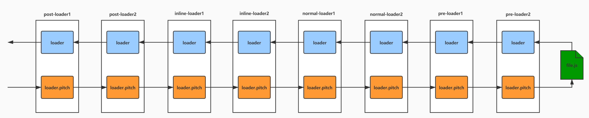

---
nav:
  title: webapck
  order: 1
---

# Loader

## Loaders

Webpack 支持使用 `loader` 对文件进行预处理。你可以构建包括 JavaScript 在内的`任何静态资源`。并且可以使用 Node.js 轻松编写自己的 loader。

- 在 `require()` 语句中使用 `loadername!` 作为前缀的方式来使用 loader
- 或者在 webpack 配置中配置 `regex` 来自动应用它们

## 1.2 loader-runner



### 1.2.1 loader 类型

loader 的叠加顺序 = `post`(后置)+`inline`(内联)+`normal`(正常)+`pre`(前置)

webpack.config.js

```js
const path = require('path');
const HtmlWebpackPlugin = require('html-webpack-plugin');
console.log(123, path.resolve(__dirname, 'loader/babel-loader.js'));
module.exports = {
  mode: 'development',
  devtool: 'source-map',
  entry: './src/index.js',
  output: {
    path: path.resolve(__dirname, 'dist'),
    filename: '[name].js',
  },
  devServer: {
    hot: false,
  },
  resolveLoader: {
    // alias: {
    //   // "babel-loader": path.resolve(__dirname, "loader/babel-loader.js")
    // },
    modules: [path.resolve('./loaders'), 'node_modules'],
  },
  module: {
    rules: [
      {
        test: /\.js/,
        use: ['normal1-loader', 'normal2-loader'],
      },
      {
        test: /\.js/,
        enforce: 'pre',
        use: ['pre1-loader', 'pre2-loader'],
      },
      {
        test: /\.js/,
        enforce: 'post',
        use: ['post1-loader', 'post2-loader'],
      },
    ],
  },
  plugins: [
    new HtmlWebpackPlugin({
      template: './src/index.html',
    }),
  ],
};
/**
 * 要想在项目中使用自定义loader
 * 1.可以使用绝对路径 path.resolve(__dirname,'loader/babel-loader.js')
 * 2.resolveLoader 配置alias
 * 3.resolveLoader 配置modules
 */
```

pre1-loader.js

```js
function loader(source) {
  return source + ';console.log("pre1")';
}
```

pre2-loader.js

```js
function loader(source) {
  return source + ';console.log("pre2")';
}
```

normal2-loader.js

```js
function loader(source) {
  return source + ';console.log("normal2")';
}
```

normal1-loader.js

```js
function loader(source) {
  return source + ';console.log("normal1")';
}
```

post2-loader.js

```js
function loader(source) {
  return source + ';console.log("post2")';
}
```

post1-loader.js

```js
function loader(source) {
  return source + ';console.log("post1")';
}
```

输出结果

```js
// title
// pre2
// pre1
// normal2
// normal1
// post2
// post1
```

例：在 `babel-loader` 之前使用 `eslint-loader` 进行代码检查 ， 之后压缩代码

### 1.2.2 pitch

pre1-loader.js

```js
function loader(source) {
  return source + ';console.log("pre1")';
}
loader.pitch = function () {
  console.log('pre1-pitch');
};
module.exports = loader;
```

...

输出结果

```js
// post1-pitch
// post2-pitch
// normal1-pitch
// normal2-pitch
// pre1-pitch
// pre2-pitch
```

pitch return 之后不再走后面的 loader

##### 1.2.2.0 less-loader

rules

```js
{
  test: /\.less$/,
  exclude: /node_modules/,
  use: ["style-loader", "less-loader"]
}
```

less-loader.js

```js
const less = require('less');
function loader(lessContent) {
  let str;
  less.render(lessContent, { filename: this.resource }, (err, output) => {
    this.callback(err, `${JSON.stringify(output.css)}`);
  });
}
module.exports = loader;
```

style-loader.js

```js
const path = require('path');
function loader(count) {
  let script = `let style = document.createElement("style")
  style.innerHTML = ${count}
  document.head.appendChild(style)`;
  return script;
}

module.exports = loader;
```

##### 1.2.2.1 style-oader

less-loader.js

```js
const less = require('less');
function loader(lessContent) {
  let str;
  less.render(lessContent, { filename: this.resource }, (err, output) => {
    console.log('css', JSON.stringify(output.css));
    str = `module.exports = ${JSON.stringify(output.css)}`;
  });
  return str;
}
module.exports = loader;
```

style-loader.js

```js
const path = require('path');
function loader() {}
loader.pitch = function (remainingRequest) {
  //现在的请求格式  style-loader!less-loader!index.less

  //style.innerHTML = require("!!../loader/less-loader.js!./index.less");
  let script = `
      let style = document.createElement('style');
      style.innerHTML = require(${stringifyRequest(
        this,
        '!!' + remainingRequest,
      )});
      document.head.appendChild(style);
    `;
  console.log(script);
  return script;
};
function stringifyRequest(loaderContext, request) {
  let prefixRep = /^-?!+/;
  let prefixResult = request.match(prefixRep);
  let prefix = prefixResult ? prefixResult[0] : '';
  const splitted = request.replace(prefixRep, '').split('!');
  const { context } = loaderContext;
  return JSON.stringify(
    prefix +
      splitted
        .map((part) => {
          part = path.relative(context, part);
          if (part[0] !== '.') part = './' + part;
          return part.replace(/\\/g, '/');
        })
        .join('!'),
  );
}
module.exports = loader;
```

#### 内联方式

可以在 import 语句或任何 `与 "import" 方法同等的引用方式` 中指定 loader。使用 ! 将资源中的 loader 分开。每个部分都会相对于当前目录解析。

```js
import Styles from 'style-loader!css-loader?modules!./styles.css';
```

通过为内联 import 语句添加前缀，可以覆盖 配置 中的所有 loader, preLoader 和 postLoader：

- 使用 ! 前缀，将禁用所有已配置的 normal loader(普通 loader)

  ```js
  import Styles from '!style-loader!css-loader?modules!./styles.css';
  ```

- 使用 !! 前缀，将禁用所有已配置的 loader（preLoader, loader, postLoader）

  ```js
  import Styles from '!!style-loader!css-loader?modules!./styles.css';
  ```

- 使用 -! 前缀，将禁用所有已配置的 preLoader 和 loader，但是不禁用 postLoaders

  ```js
  import Styles from '-!style-loader!css-loader?modules!./styles.css';
  ```

选项可以传递查询参数，例如 `?key=value&foo=bar`，或者一个 JSON 对象，例如 `?{"key":"value","foo":"bar"}`
